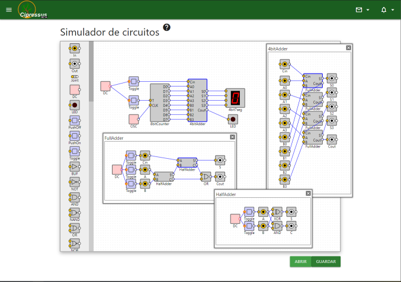
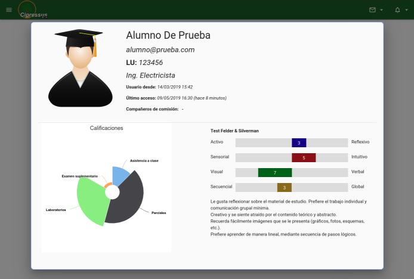
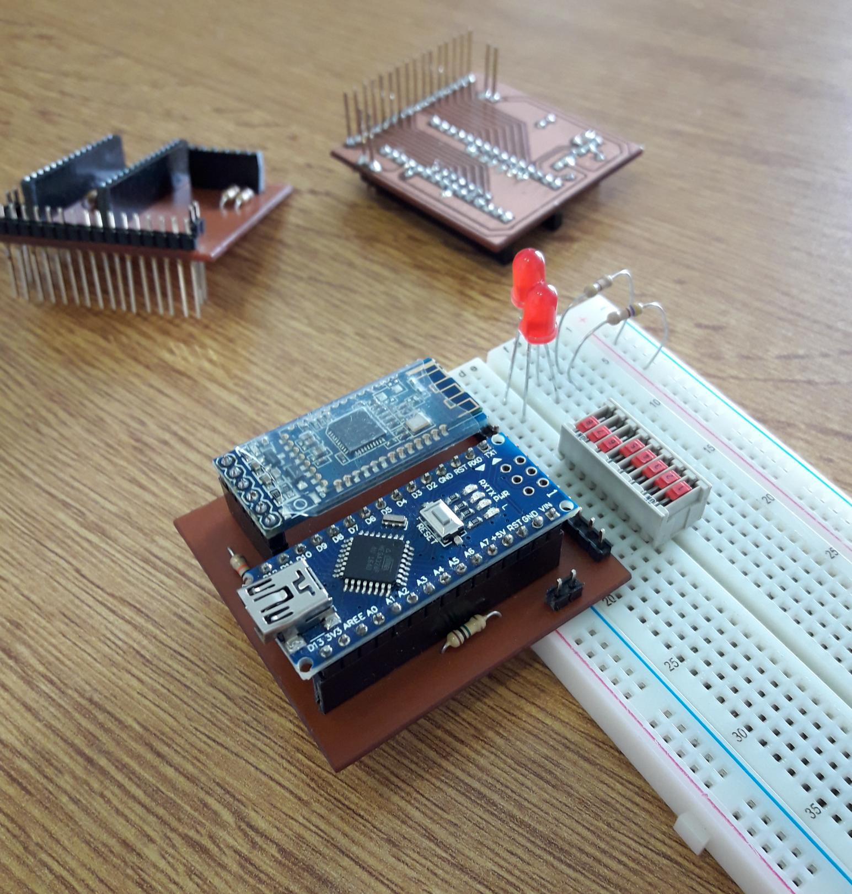

# Cipressus

Sistema de gestión de contenidos para el aprendizaje (LCMS). Implementa un sistema de cómputo automático de calificaciones y permite la consulta en tiempo real de resultados de evaluaciones, noticias y cronograma de cátedra, descarga de material de estudio y muchas otras utilidades. Incluye una GUI para controlar un tester de circuitos digitales basado en Arduino y un simulador gráfico de circuitos lógicos. Por medio del tester se puede acceder a una interface tipo analizador lógico y crear simulaciones que son controladas mediante circuitos digitales físicos.  


 

### Características
  - Acceso mediante registro con email y contraseña.  
  - Usuarios con roles de alumnos, docentes o visitante.  
  - Perfil de usuario personalizable.  
  - Publicación de comunicados y novedades con posibilidad de incorporar comentarios.  
  - Consulta de cronograma de actividades.  
  - Calificaciones actualizadas en tiempo real.  
  - Notificaciones y mensajería instantánea. 
  - Tablero de calificaciones animado con información de progreso de la materia, actividades entregadas, calificaciones generales del curso y lista de eventos próximos.  
  - Entrega online de informes o archivos para evaluación.  
  - Interfaz gráfica para conectar el probador digital de circuitos lógicos y realizar verificación de funcionamiento y simulación de sistemas.  
  - Simulador de circuitos lógicos embebido en la misma app.  
  - Evaluación del Test de Felder & Silverman o instrumento ILS para usuarios alumnos.  
  - Estadística y analíticos de usuarios alumnos sobre uso de la app, origen y frecuencia de acceso, progreso de notas.  
  - Evaluación de asistencia ágil con cómputo automático.  
  - Descarga de material de estudio, trabajos prácticos, libros, apuntes, programas, etc.  

### Hardware adjunto

 


## Contacto
LSD | Laboratorio de Sistemas Digitales  
DIEC | Departamento de Ingeniería Eléctrica y Computadoras  
UNS | Universidad Nacional del Sur  
San Andrés 800, CP8000 Bahía Blanca  
Buenos Aires, Argentina  
Teléfono: +54 291 4595153/4  
Website: http://www.diec.uns.edu.ar/rts  


#### Diseño e implementación
Ing. Matías J. Micheletto  
Email: matias.micheletto@uns.edu.ar  
https://matiasmicheletto.github.io  


## Documentación

### Tecnologías utilizadas
#### Angular
http://angularjs.org/  
Framework para el control de la app.
#### Materialize
http://materializecss.com/  
Estilo de la GUI.
#### Firebase
http://firebase.google.com/  
Para el control de autenticación de usuarios y almacenamiento de información en la nube.
#### HighCharts  
http://highcharts.com/  
Graficos de datos estadísticos.
#### JQuery  
http://jquery.com/  
Como dependencia requerida para FullCalendar y SimCirJS
#### Fullcalendar  
http://fullcalendar.io/  
Calendario de eventos para el cronograma de la materia. 
#### SimCirJS 
https://kazuhikoarase.github.io/simcirjs/   
Simulador de circuitos lógicos digitales.
#### Tone  
https://tonejs.github.io/  
Generador de música interactivo para el simulador.  
#### Quill  
https://quilljs.com/   
https://github.com/kensnyder/quill-image-resize-module  
Editor de texto enriquecido para crear publicaciones con comunicados y noticias.  
#### Moment
http://momentjs.com/  
Operaciones de fecha y hora.
#### Is  
https://is.js.org/   
Identificación de Sist. Operativo, navegador, dispositivo, etc.  
#### Vis
http://visjs.org/  
Visualización de árboles.


## Roles de usuarios
Los usuarios pueden tener tres roles distintos: visitante, alumno o docente. Cuando un usuario se registra con su email, se le asigna el rol de visitante y sólo puede acceder a las herramientas de Cipressus: simulador, mapas-K, probador, etc.  

Los usuarios con rol de docente o administrador del sistema, tienen acceso a toda la configuración y roles de otros usuarios. Cada usuario administrador tiene asociado un curso, que puede cambiar en cualquier momento por otro de la lista de cursos creada. Cuando un nuevo usuario se registra, el usuario administrador puede aceptar la subscripción del nuevo usuario como miembro del curso que actualmente tiene asociado y de esta manera, el usuario visitante pasa a tener el rol de alumno.

Los usuarios alumnos tienen asociado una lista de actividades que corresponden a las del curso al cual fueron subscriptos. A medida que completan las actividades y los usuarios docentes califican dichas actividades, van incrementando su puntaje final. Los usuarios alumnos pueden ver un resumen completo de las actividades del curso en cronograma, descargar material de estudio del curso actual, consultar sus propias calificaciones y la de sus compañeros de curso (en forma anónima).

## Evaluación de calificaciones
Las actividades del curso se organizan en una estructura jerárquica que permite calcular la calificación general un alumno o parcial de cada actividad realizada mediante algoritmos de recorrido de árboles, con funciones recursivas y computando la suma ponderada de los puntajes obtenidos y registrados en cada nivel de este árbol, que contiene los factores de ponderación o puntajes absolutos de dichas actividades. Para cada alumno se registra una lista de notas referenciadas a las actividades del árbol de puntajes. Para actividades con vencimiento se pueden definir funciones de costo que aplican sobre las calificaciones en función del tiempo transcurrido desde el vencimiento de la actividad hasta el cumplimiento de la misma.  


## Estructura de la Base de Datos
Se emplea una base de datos No-SQL (Firebase) y los datos se estructuran en forma de árbol.

```
-activities             // Contiene la estructura de actividades, puntajes, vencimientos, etc
 |
 + ... (arbol)
-events/courseID        // Lista de eventos de calendario
 | 
 +-(child_key)          // ID firebase del evento
  |
  +-attendance          // Asistencia es obligatoria
  +-start               // Inicio ms unix
  +-end                 // Fin ms unix
  +-author              // ID del autor
  +-title               // Titulo del evento
  +-info                // Detalles del evento formato html
  +-timestamp           // Fecha de publicacion/edicion
  +-color               // Color de la etiqueta
-news/courseID          // Lista de comunicados a mostrar en home
 |
 +-(child_key)          // ID firebase de la noticia
  |
  +-author              // ID del autor
  +-content             // Contenido del post formato html
  +-order               // Numero para ordenar el listado
  +-timestamp           // Fecha de publicacion/edicion
  +-title               // Titulo del post
  +-comments            // Comentarios de esta publicación
   |
   +-(child_key)        // ID del comentario
    |
    +-uid               // ID del usuario que comenta
    +-text              // Texto el comentario
    +-timestamp         // Estampa de tiempo del comentario
-notifications          // Lista de notificaciones para todos los usuarios
 |
 +-(child_key)          // ID firebase de la notificacion
  |
  +-uid                 // ID del destinatario
  +-title               // Titulo de la notificacion
  +-text                // Texto descriptivo
  +-link                // Enlace (opcional)
  +-timestamp           // Fecha de generacion
  +-read                // Acuse de lectura
-sources                // Listas de archivos
 |
 +-(child_key)          // Subcategoria de directorio
  |
  +-name                // Nombre del subdirectorio
  +-files               // ID del archivo
   |
   +-(child_key)        // Identificador del archivo
    |
    +-link              // Enlace al storage
    +-name              // Nombre visible (editable)
    +-filename          // Nombre en storage
    +-size              // Tamanio en storage
    +-format            // Formato del archivo
    +-uploaded          // Fecha de carga
-submissions/courseID   // Lista de entregas realizadas por alumnos
 |
 +-(child_key)          // Identificador de la entrega
  |
  +-authors             // Autores de la entrega (apellido de los integrantes separado por coma)
  +-filename            // Nombre de archivo subido
  +-link                // Enlace al storage
  +-activity            // Identificador de la actividad entregada
  +-status              // Estado de la correccion
   |
   +-(child_key)        // Identificador del registro
    |
    +-timestamp         // Fecha/hora del registro
    +-action            // Acciones del registro (0:subido, 1:descargado, 2:observacion, 3:evaluado)
    +-user              // Usuario que realizo la accion
    +-display           // Mensaje a mostrar del estado de revision
    +-obs               // Observaciones
-users_private          // Informacion de usuarios alumnos
 |
 +-(child_key)          // ID firebase del usuario
  |
  +-admin               // True/false dependiendo de si es administrador
  +-enrolled            // Fecha de aprobacion como usuario alumno
  +-scores              // Arreglo de notas
   |
   +-(child_name)       // Nombre de la actividad 
    |
    +-evaluator         // ID de quien evaluo
    +-score             // Puntaje de 0 a 100
    +-timestamp         // Fecha/hora de correccion
  +-submits             // Lista de fechas de entrega de tps
   |
   +-(child_name)       // Nombre de la actividad 
    |
    +-evaluator         // ID de quien evaluo
    +-date              // Fecha de entrega de la actividad
    +-timestamp         // Fecha/hora de correccion
  +-attendance          // Para computo de asistencia a clase
   |
   +-(child_key)        // ID del evento asistido
    |
    +-evaluator         // ID de quien tomo asistencia
    +-timestamp         // Fecha/hora de evaluacion de asistencia
-users_public           // Datos de usuarios (unico campo editable por cualquier usuario)
 |
 +-(child_key)          // ID firebase
  |
  +-avatar              // Foto de perfil
  +-degree              // Carrera
  +-email               // Email
  +-lu                  // LU
  +-name                // Nombre
  +-secondName          // Apellido
  +-partners            // Compañeros de comision
   |
   +-(array_index)      // Indice de arreglo e identificador de usuario como valor
  +-activity            // Monitor de actividad
   |
   +-last_login         // Estampa de tiempo de ultimo acceso
   +-so                 // Sist. operativos utilizados
   +-browser            // Navegadores utilizados
   +-item               // Contadores de acceso a secciones de la pagina
  +-simulations            // Carpeta para guardar simulaciones de SimCirJS
   |
   +-(child_key)        // Identificador del circuito
    |
    +-name              // Nombre de archivo
    +-size              // Tamanio
    +-timestamp         // Fecha y hora de generado
    +-data              // Datos guardados de la simulacion
  +-test_fs             // Resultados del test Felder-Silverman
   |
   +-answers            // Arreglo de respuestas
   +-changes            // Arreglo de cambios en respuestas
   +-starTime           // Fecha/hora de inicio del test
   +-timeline           // Tiempos de respuesta de cada pregunta
-metadata               // Informacion adicional que emplea la app
 |
 +-courses              // Informacion de cursos creados
  |
  +-(child_key)         // ID del curso (coincide con el del arbol de actividades)
   |
   +-name               // Nombre del curso
   +-start              // Inicio (timestamp)
   +-end                // Finalizacion (timestamp)
   +-enrolled           // Cantidad de usuarios registrados
 +-updates              // Estampas de tiempo de última actualizacion de los datos de cada vista
  |
  +-news 
  +-events
  +-sources
  +-submissions
 +-notifications        // Arreglos de UIDs de usuarios subscriptos a cada tipo de evento
  |
  +-new_user            // Nuevo usuario registrado (solo lo pueden configurar usuarios admins)
  +-submission          // Nueva entrega realizada (se diferencia por curso)
```

## Setup

  - Crear proyecto Firebase con una cuenta de Google.  
  - Copiar el código de configuración Firebase en objeto ```core.db.config```, en cipressus.js.  
  - Registrar manualmente, desde la consola firebase, un usuario admin y cargar el arbol de actividades de la asignatura.  
  - Definir las reglas de escritura y lectura de información de la db:  

```json
{
  "rules": {
    "activities":{
    	".read": "auth != null",
      ".write": "root.child('users_private/'+auth.uid+'/admin').val() === true"  
    },
    "news":{
      ".read":"auth != null",
      ".write":"auth != null"
    },
    "events":{
      ".read":"auth != null",
      ".write":"root.child('users_private/'+auth.uid+'/admin').val() === true"
    },
    "sources":{
      ".read" : "auth != null",
      ".write" : "root.child('users_private/'+auth.uid+'/admin').val() === true"  
    },
    "submissions":{
      ".read":"auth != null",
      ".write":"auth != null"
    },
    "notifications":{
      ".read":"auth != null",
      ".write":"auth != null"
    },
    "users_private":{
      ".read":"auth != null",
      ".write":"root.child('users_private/'+auth.uid+'/admin').val() === true"
    },
    "users_public":{ 
      ".read":"auth != null",
      ".write":"auth != null"
    },
    "metadata":{
      ".read":"auth != null",
      ".write":"auth != null"
    }
  }
}
```
  - Configurar CORS para la descarga de archivos (ver documentacion Firebase).  
  - Hostear en servidor con certificado SSL para que funcionen los service workers.  


### Backlog
[Impr] Optimizar o mejorar  
[Bug] Error para corregir  
[Feature] Agregar característica  

  - [Feature] Gestion de cursos. Configuración de árbol de actividades. Fechas de vencimientos.  
  - [Bug] Actualizacion de noticias: Al actualizar publicación se duplica la entrada y se agrega un "undefined" en db. No funciona el cambio de orden de articulos.  
  - [Impr] Entrega de trabajos. No permitir dos entregas de lo mismo. Cargar nota directamente. 
  - [Feature] Probador de circuitos: eliminar circuitos guardados. Guardar circuitos publicos (compartir). Modulo audio de 8 canales.  
-------- Testing
  - [Feature] Material de estudio debe ir asociado a cursos y una misma entrada puede estar en dos cursos.
  - [Feature] En creacion de actividades con vencimiento, generar evento para mostrar las fechas en cronograma de actividades.
  - [Feature] Detallar clases asistidas. En progreso, mostrar cantidad de actividades calificadas y por completar.
  - [Feature] Incluir soporte touch para el simulador.  
