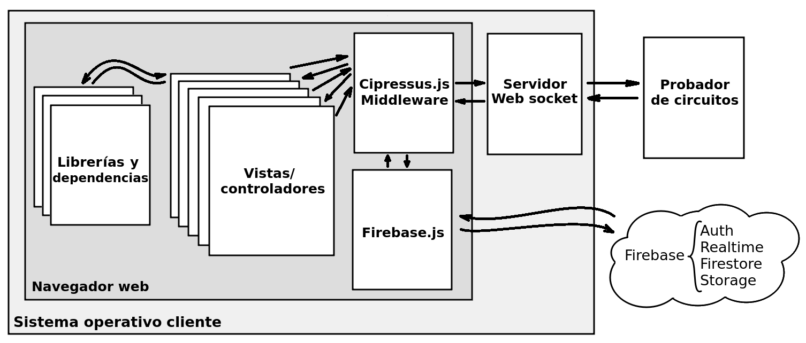
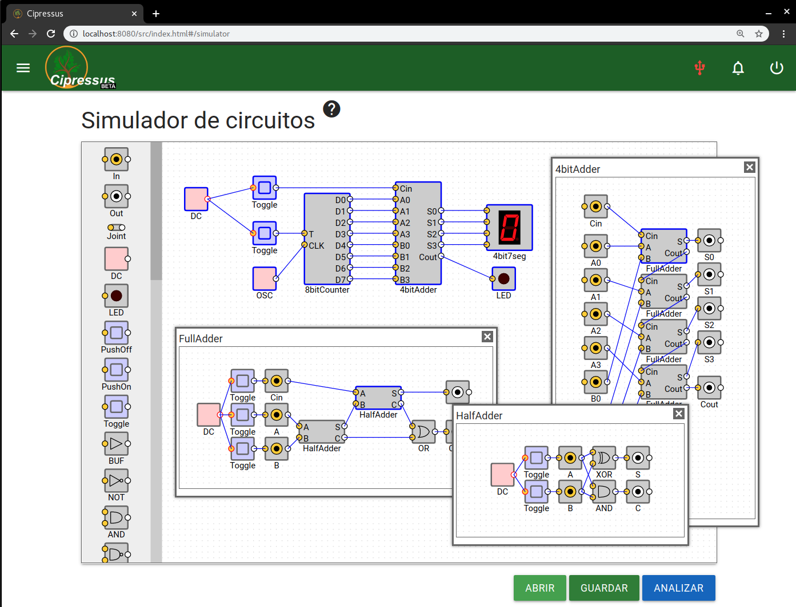
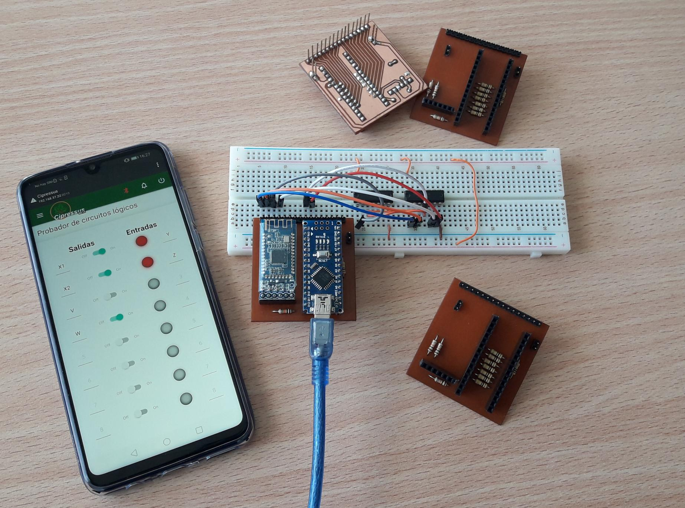
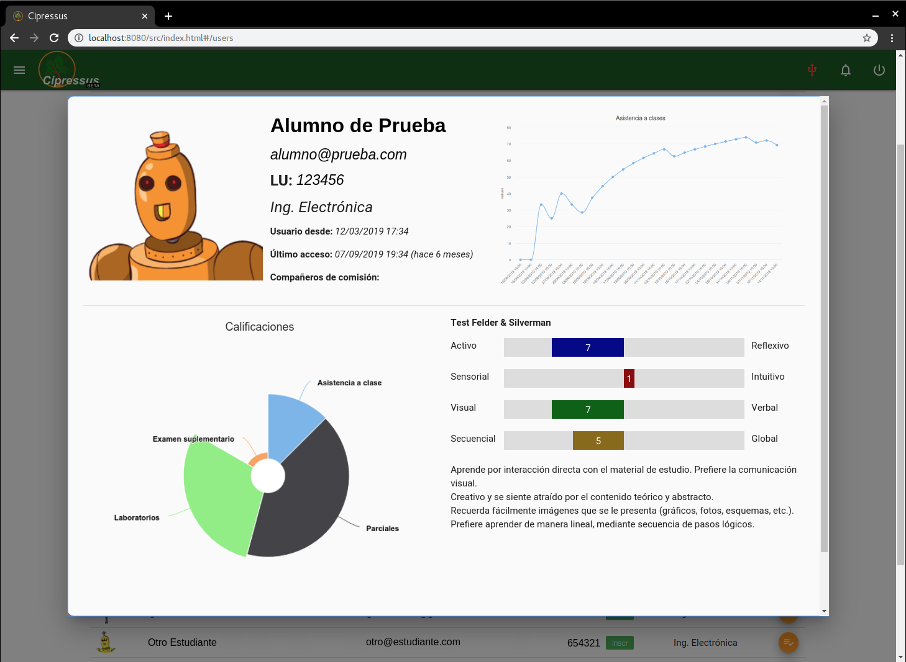

# Acerca de

Cipressus es un LCMS que pone a disposición de los practicantes de sistemas digitales, un conjunto de herramientas interactivas que permiten asistirlos y guiarlos en el desarrollo de habilidades de resolución de problemas. Como resultando de esta interacción de los alumnos con el sistema, se genera una gran cantidad de datos que permite a un docente evaluar el desempeño de todos los estudiantes en general o de cada alumno en particular, acorde a las habilidades individuales y preferencias de aprendizaje de cada uno mediante un sistema autogestionado y configurable.

#### Esquema general
 

#### Simulador de circuitos digitales
 

#### Probador de circuitos
 

#### Perfil de usuarios
 


## Implementado con

| Librería | Documentación | Función |
-----------|---------------|----------|
| Angular | http://angularjs.org/ | Data Binding del Front-End. |  
| Materialize | http://materializecss.com/ | Componentes de la GUI.  |  
| Firebase | http://firebase.google.com/ | Autenticación, base de datos, mensajería, notificaciones, almacenamiento. |  
| HighCharts | http://highcharts.com/ | Gráficos interactivos. |  
| Fullcalendar | http://fullcalendar.io/ | Calendario de eventos para el cronograma de la materia.  |  
| SimCirJS  | https://kazuhikoarase.github.io/simcirjs/ | Simulador de circuitos digitales. |  
| JQuery | http://jquery.com/ | Dependencia de FullCalendar y SimCirJS. |  
| Tone | https://tonejs.github.io/ | Generador de audio para el simulador. |    
| Quill | https://quilljs.com/, https://github.com/kensnyder/quill-image-resize-module | Editor de texto enriquecido para crear publicaciones de contenido multimedia. |    
| Moment | http://momentjs.com/ | Operaciones de fecha y hora. |  
| Is | https://is.js.org/ | Identificación de Sist. Operativo, navegador, dispositivo, disponibilidad de red, ubicación, etc. |  
| Vis | http://visjs.org/ | Visualización de modelos abstractos. |  


## Base de Datos de Tiempo Real

```
-activities             // [map] Contiene la estructura de actividades, puntajes, vencimientos, etc
 |
 + ... (definido por administrador)
-events/courseID        // [map] Lista de eventos de calendario
 | 
 +-(child_key)          // [map] ID firebase del evento
  |
  +-attendance          // [bool] asistencia obligatoria
  +-start               // [number] Inicio ms unix
  +-end                 // [number] Fin ms unix
  +-author              // [string] ID autor
  +-title               // [string] Titulo del evento
  +-info                // [string] Detalles del evento formato html
  +-timestamp           // [number] Fecha de publicacion/edicion
  +-color               // [string] Color de la etiqueta
-news/courseID          // [map] Lista de comunicados a mostrar en home
 |
 +-(child_key)          // [map] ID firebase de la noticia
  |
  +-author              // [string] ID del autor
  +-content             // [string] Contenido del post formato html
  +-order               // [number] Numero para ordenar el listado
  +-timestamp           // [number] Fecha de publicacion/edicion
  +-title               // [string] Titulo del post
  +-comments            // [map] Comentarios de esta publicación
   |
   +-(child_key)        // [map] ID del comentario
    |
    +-uid               // [string] ID del usuario que comenta
    +-text              // [string] Texto el comentario
    +-timestamp         // [number] Estampa de tiempo del comentario
-notifications          // [map] Lista de notificaciones para todos los usuarios
 |
 +-(child_key)          // [map] ID firebase de la notificacion
  |
  +-uid                 // [string] ID del destinatario
  +-title               // [string] Titulo de la notificacion
  +-text                // [string] Texto descriptivo
  +-link                // [string] Enlace (opcional)
  +-timestamp           // [number] Fecha de generacion
  +-read                // Acuse de lectura
-sources                // [map] Listas de archivos
 |
 +-(child_key)          // [map] Subcategoria de directorio
  |
  +-name                // [string] Nombre del subdirectorio
  +-files               // [string] ID del archivo
   |
   +-(child_key)        // [map] Identificador del archivo
    |
    +-link              // [string] Enlace al storage
    +-name              // [string] Nombre visible (editable)
    +-filename          // [string] Nombre en storage
    +-size              // [number] Tamanio en storage
    +-format            // [string] Formato del archivo
    +-uploaded          // [number] Fecha de carga
-submissions/courseID   // [map] Lista de entregas realizadas por alumnos
 |
 +-(child_key)          // [map] Identificador de la entrega
  |
  +-authors             // [string] Autores de la entrega (apellido de los integrantes separado por coma)
  +-filename            // [string] Nombre de archivo subido
  +-link                // [string] Enlace al storage
  +-activity            // [string] Identificador de la actividad entregada
  +-status              // [map] Estado de la correccion
   |
   +-(child_key)        // [map] Identificador del registro
    |
    +-timestamp         // [number] Fecha/hora del registro
    +-action            // [number] Acciones del registro (0:subido, 1:descargado, 2:observacion, 3:evaluado)
    +-user              // [string] Usuario que realizo la accion
    +-display           // [string] Mensaje a mostrar del estado de revision
    +-obs               // [string] Observaciones
+-simulations           // [map] Simulaciones guardadas de SimCirJS
   |
   +-(child_key)        // [map] Identificador del circuito
    |
    +-name              // [string] Nombre de archivo
    +-size              // [number] Tamanio
    +-timestamp         // [number] Fecha y hora de generado
    +-data              // [string] Datos guardados de la simulacion
-users_private          // [map] Informacion de usuarios alumnos
 |
 +-(child_key)          // [map] ID firebase del usuario
  |
  +-admin               // [bool] Si es administrador
  +-enrolled            // [number] Fecha de aprobacion como usuario alumno
  +-scores              // [map] Arreglo de notas
   |
   +-(child_name)       // [map] Nombre de la actividad 
    |
    +-evaluator         // [string] ID de quien evaluo
    +-score             // [number] Puntaje de 0 a 100
    +-timestamp         // [number] Fecha/hora de correccion
  +-submits             // [map] Lista de fechas de entrega de tps
   |
   +-(child_name)       // [map] Nombre de la actividad 
    |
    +-evaluator         // [string] ID de quien evaluo
    +-date              // [number] Fecha de entrega de la actividad
    +-timestamp         // [number] Fecha/hora de correccion
  +-attendance          // [map] Para computo de asistencia a clase
   |
   +-(child_key)        // [map] ID del evento asistido
    |
    +-evaluator         // [string] ID de quien tomo asistencia
    +-timestamp         // [number] Fecha/hora de evaluacion de asistencia
-users_public           // [map] Datos de usuarios (unico campo editable por cualquier usuario)
 |
 +-(child_key)          // [map] ID firebase del usuario (UID)
  |
  +-avatar              // [string] Foto de perfil
  +-degree              // [string] Carrera
  +-email               // [string] Email
  +-lu                  // [number] LU
  +-name                // [string] Nombre
  +-secondName          // [string] Apellido
  +-partners            // [map] Compañeros de comision
   |
   +-(array_index)      // [number] Indice de arreglo e identificador de usuario como valor
  +-activity            // [map] Monitor de actividad
   |
   +-last_login         // [number] Estampa de tiempo de ultimo acceso
   +-so                 // [map] Sist. operativos utilizados
   +-browser            // [map] Navegadores utilizados
   +-item               // [map] Contadores de acceso a secciones de la pagina
  +-test_fs             // [map] Resultados del test Felder-Silverman
   |
   +-answers            // [map] Arreglo de respuestas
   +-changes            // [map] Arreglo de cambios en respuestas
   +-starTime           // [number] Fecha/hora de inicio del test
   +-timeline           // [map] Tiempos de respuesta de cada pregunta
-metadata               // [map] Informacion adicional que emplea la app
 |
 +-courses              // [map] ID para cada curso
  |
  +-(child_key)         // [map] ID del curso (coincide con el del arbol de actividades)
   |
   +-name               // [string] Nombre del curso
   +-start              // [number] Inicio (timestamp)
   +-end                // [number] Finalizacion (timestamp)
   +-enrolled           // [number] Cantidad de usuarios registrados
 +-updates              // [map] Estampas de tiempo de última actualizacion de los datos de cada vista
  |
  +-news                // [number] Ultima actualizacion de noticias
  +-events              // [number] Ultima actualizacion de eventos de calendario
  +-sources             // [number] Ultima actualizacion de archivos
  +-submissions         // [number] Ultima actualizacion de entregas
 +-notifications        // [map] Arreglo de UIDs subscriptos a cada tipo de evento
  |
  +-new_user            // [map] Nuevo usuario registrado (solo lo pueden configurar usuarios admins)
  +-submission          // [map] Nueva entrega realizada (se diferencia por curso)
```

## Setup

  - Crear proyecto Firebase en https://firebase.google.com/.  
  - Definir las reglas de escritura y lectura de información de la db:  

```json
{
  "rules": {
    "activities":{
    	".read": "auth != null",
      ".write": "root.child('users_private/'+auth.uid+'/admin').val() === true"  
    },
    "news":{
      ".read":"auth != null",
      ".write":"auth != null"
    },
    "events":{
      ".read":"auth != null",
      ".write":"root.child('users_private/'+auth.uid+'/admin').val() === true"
    },
    "sources":{
      ".read" : "auth != null",
      ".write" : "root.child('users_private/'+auth.uid+'/admin').val() === true"  
    },
    "submissions":{
      ".read":"auth != null",
      ".write":"auth != null"
    },
    "notifications":{
      ".read":"auth != null",
      ".write":"auth != null"
    },
    "users_private":{
      ".read":"auth != null",
      ".write":"root.child('users_private/'+auth.uid+'/admin').val() === true"
    },
    "users_public":{ 
      ".read":"auth != null",
      ".write":"auth != null"
    },
    "metadata":{
      ".read":"auth != null",
      ".write":"auth != null"
    }
  }
}
```
  - Copiar el código de configuración Firebase en objeto ```core.db.config```, en cipressus.js.  
  - Registrar manualmente, desde la consola firebase, un usuario administrador.  
  - Configurar CORS para la descarga de archivos (ver documentacion Firebase).  
  - Hostear en servidor con certificado SSL para que funcionen los service workers.  

--------------------------------------------------
### Contacto

Matías J. Micheletto  

Email: matias.micheletto@uns.edu.ar  
Portafolio: https://matiasmicheletto.github.io  

--------------------------------------------------

LSD | Laboratorio de Sistemas Digitales  
DIEC | Departamento de Ingeniería Eléctrica y Computadoras  
UNS | Universidad Nacional del Sur  
San Andrés 800, CP8000 Bahía Blanca  
Buenos Aires, Argentina  
Teléfono: +54 291 4595153/4  
Sitio web: http://www.diec.uns.edu.ar/rts  
